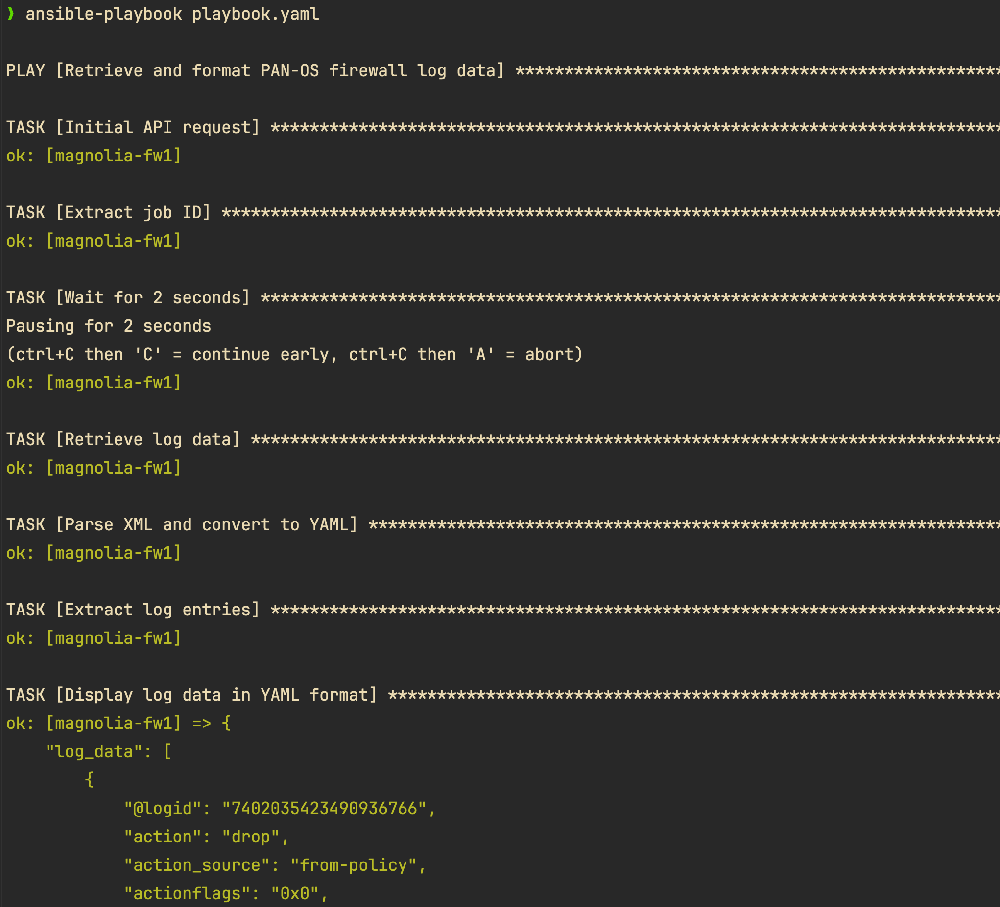
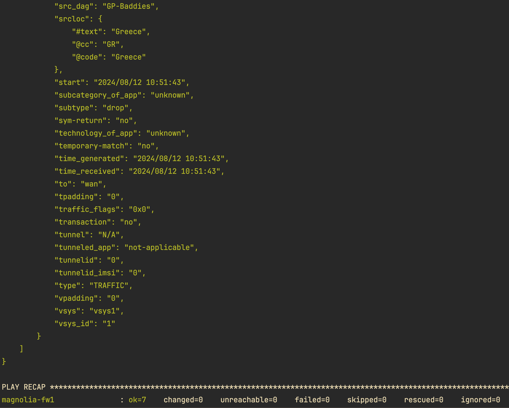

# PAN-OS Firewall Log Retrieval and Formatting 📊

This README provides an overview of our Ansible project for retrieving and formatting log data from PAN-OS firewalls. 🚀

## Table of Contents

- [PAN-OS Firewall Log Retrieval and Formatting 📊](#pan-os-firewall-log-retrieval-and-formatting-)
  - [Table of Contents](#table-of-contents)
  - [Overview](#overview)
  - [Prerequisites](#prerequisites)
  - [Setup](#setup)
    - [Creating a Python Virtual Environment](#creating-a-python-virtual-environment)
    - [Installing Ansible](#installing-ansible)
  - [Project Structure](#project-structure)
  - [Inventory](#inventory)
  - [Playbook Structure](#playbook-structure)
  - [Ansible Configuration](#ansible-configuration)
  - [Execution Workflow](#execution-workflow)

## Overview

Our Ansible project aims to automate the retrieval and formatting of log data from PAN-OS firewalls. By leveraging Ansible's powerful automation capabilities, we can streamline the process of fetching traffic logs, particularly those related to dropped packets, and present them in a structured YAML format for easy analysis. 🎯

## Prerequisites

Before getting started, ensure that you have the following prerequisites installed on your local machine:

- Python (version 3.9+) 🐍
- pip (Python package manager) 📦

## Setup

### Creating a Python Virtual Environment

To create a Python virtual environment, follow these steps:

1. Open a terminal and navigate to the project directory.
2. Run the following command to create a virtual environment:

   ```bash
   python -m venv venv
   ```

3. Activate the virtual environment:

   - For Windows:

     ```bash
     venv\Scripts\activate
     ```

   - For macOS and Linux:

     ```bash
     source venv/bin/activate
     ```

### Installing Ansible

With the virtual environment activated, install Ansible and required collections using pip:

```bash
pip install ansible
ansible-galaxy collection install ansible.utils
```

## Project Structure

Our project is structured as follows:

```
.
├── ansible.cfg
├── inventory.yaml
├── playbook.yaml
└── README.md
```

## Inventory

Our Ansible inventory file (`inventory.yaml`) defines the target firewalls for our playbook:

```yaml
all:
  children:
    firewalls:
      hosts:
        magnolia-fw1:
          ansible_host: 192.168.255.2
```

## Playbook Structure

Our Ansible playbook (`playbook.yaml`) is structured to retrieve and format log data from PAN-OS firewalls:

```yaml
---
- name: Retrieve and format PAN-OS firewall log data
  hosts: firewalls
  gather_facts: no
  connection: local

  vars:
    amount_of_logs_to_return: 5
    api_key: "myapikey=="
    ansible_python_interpreter: "{{ ansible_playbook_python }}"

  tasks:
    - name: Initial API request
      ansible.builtin.uri:
        url: "https://{{ inventory_hostname }}/api/?key={{ api_key }}&type=log&log-type=traffic&query=(%20subtype%20eq%20%27drop%27%20)&nlogs={{ amount_of_logs_to_return }}"
        method: GET
        return_content: yes
        validate_certs: False
      register: initial_response

    # ... [other tasks]

    - name: Display log data in YAML format
      ansible.builtin.debug:
        var: log_data
        verbosity: 0
```

The playbook performs the following main steps:
1. Initiates an API request to retrieve log data
2. Extracts the job ID from the initial response
3. Waits for 2 seconds to allow log processing
4. Retrieves the processed log data
5. Parses the XML response and converts it to YAML
6. Displays the formatted log data

## Ansible Configuration

Our `ansible.cfg` file contains various settings to optimize Ansible's behavior:

```ini
[defaults]
host_key_checking = False
host_key_auto_add = True
retry_files_enabled = False
forks = 15
gathering = smart
fact_caching = jsonfile
fact_caching_connection = /tmp
deprecation_warnings = False
log_path = /tmp/ansible.log
ansible_debug = True
timeout = 240
interpreter_python = /usr/local/bin/python
nocows = 1
inventory = ./inventory.yaml
roles_path = ./roles

[persistent_connection]
command_timeout = 45
```

These settings enhance performance, disable host key checking, and configure various timeouts and paths.

## Execution Workflow

To execute our Ansible playbook, follow these steps:

1. Ensure that you have activated the Python virtual environment.
2. Run the following command:

   ```bash
   ansible-playbook playbook.yaml
   ```

3. Ansible will connect to the target firewalls and execute the tasks defined in the playbook, retrieving and formatting the log data. 🚀

## Screenshots





Feel free to explore the playbook and customize it according to your specific requirements. Happy automating! 😄