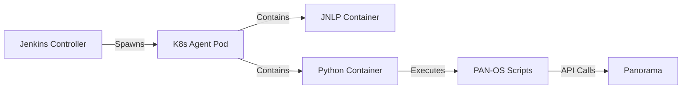

# Jenkins Examples

End-to-end framework for running PAN-OS automation pipelines on Jenkins deployed to Kubernetes, with dynamic agent pods executing Python scripts against Panorama.

## Architecture

## Components

| Component | Description |
|-----------|-------------|
| [Pipelines](pipelines.md) | Groovy pipeline scripts for address objects and security policies |
| [Infrastructure](infrastructure.md) | Docker images, Helm charts, and K8s manifests for Jenkins-on-K8s |

## How It Works

1. **Jenkins Controller** runs on Kubernetes via the Helm chart
2. **Pipeline jobs** define multi-container pod templates (JNLP agent + Python)
3. **Agent pods** spawn dynamically for each build, then terminate
4. **Python containers** execute automation scripts against Panorama
5. **RBAC manifests** grant agent pods permission to interact with the K8s API
