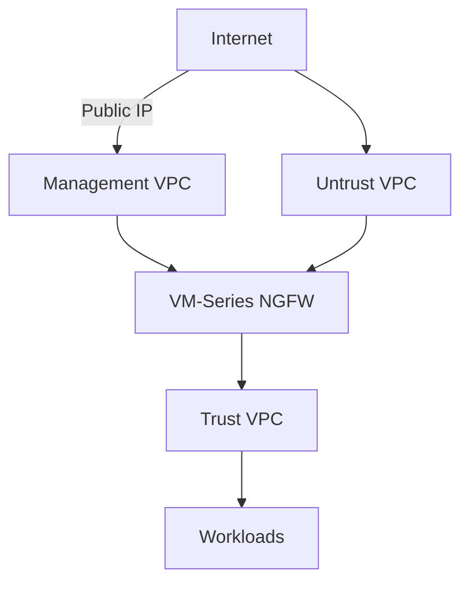

# GCP VM-Series Terraform Example

[View on GitHub](https://github.com/cdot65/paloaltonetworks-automation-examples/tree/main/terraform/gcp/vmseries)

Deploys a Palo Alto Networks VM-Series NGFW on Google Cloud Platform using the official `PaloAltoNetworks/swfw-modules` Terraform module.

## What Gets Created

- 3 VPC networks (management, untrust, trust) with subnets
- Firewall rules for each network
- VM-Series instance with interfaces on all three networks
- Public IP for management access

## Architecture

## Prerequisites

- GCP project with billing enabled
- Terraform >= 1.5
- `gcloud` CLI authenticated
- VM-Series BYOL or PAYG subscription in GCP Marketplace

## Key Variables

| Variable | Description |
|----------|-------------|
| `project_id` | GCP project ID |
| `region` | GCP region for deployment |
| `allowed_mgmt_ips` | CIDR blocks allowed to access management interface |
| `ssh_keys` | SSH public key for VM access |
