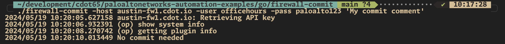

# PAN-OS Commit Script 📚

This README provides an overview of our Go project and guides you through the setup and execution process. 🚀

## Table of Contents

- [Overview](#overview)
- [Prerequisites](#prerequisites)
- [Setup](#setup)
  - [Creating a Go Environment](#creating-a-go-environment)
  - [Installing Dependencies](#installing-dependencies)
- [main.go](#maingo)
- [Execution Workflow](#execution-workflow)
  - [Screenshots](#screenshots)
- [Execution Options](#execution-options)

## Overview

Our Go project aims to provide a script to perform commit operations on PAN-OS devices like firewalls and Panorama. This script is intended to be used after a Terraform operation but can be used standalone as well. 🎯

## Prerequisites

Before getting started, ensure that you have the following prerequisites installed on your local machine:

- Go (version 1.20+) 🐍

## Setup

### Creating a Go Environment

To create a Go virtual environment, follow these steps:

1. Open a terminal and navigate to the project directory.
2. Initialize the Go module and tidy up the dependencies:

   ```bash
   go mod init github.com/cdot65/panos-commit
   go mod tidy
   ```

### Installing Dependencies

Install our project's dependencies (if not already done by `go mod tidy`):

```bash
go get github.com/PaloAltoNetworks/pango
```

Compile the source code and put it somewhere in your $PATH (such as $HOME/bin):

```bash
curl https://raw.githubusercontent.com/PaloAltoNetworks/terraform-provider-panos/master/scripts/firewall-commit.go > firewall-commit.go
go build firewall-commit.go
mv firewall-commit ~/bin
firewall-commit -h
```

## main.go

Our primary Go file (`main.go`) is structured as follows:

```go
package main

import (
    "flag"
    "log"
    "strings"
    "time"

    "github.com/PaloAltoNetworks/pango"
    "github.com/PaloAltoNetworks/pango/commit"
)

func main() {
    var (
        err                                                      error
        configFile, hostname, username, password, apiKey, admins string
        edan, eso, epao, force                                   bool
        jobId                                                    uint
        sleep                                                    int64
        timeout                                                  int
    )

    log.SetFlags(log.Ldate | log.Ltime | log.Lmicroseconds)

    flag.StringVar(&configFile, "config", "", "JSON config file with panos connection info")
    flag.StringVar(&hostname, "host", "", "PAN-OS hostname")
    flag.StringVar(&username, "user", "", "PAN-OS username")
    flag.StringVar(&password, "pass", "", "PAN-OS password")
    flag.StringVar(&apiKey, "key", "", "PAN-OS API key")
    flag.StringVar(&admins, "admins", "", "CSV of specific admins for partial config commit")
    flag.BoolVar(&edan, "exclude-device-and-network", false, "Exclude device and network")
    flag.BoolVar(&eso, "exclude-shared-objects", false, "Exclude shared objects")
    flag.BoolVar(&epao, "exclude-policy-and-objects", false, "Exclude policy and objects")
    flag.BoolVar(&force, "force", false, "Force a commit even if one isn't needed")
    flag.Int64Var(&sleep, "sleep", 1, "Seconds to sleep between checks for commit completion")
    flag.IntVar(&timeout, "timeout", 10, "The timeout for all PAN-OS API calls")
    flag.Parse()

    // Connect to the firewall.
    fw := &pango.Firewall{Client: pango.Client{
        Hostname: hostname,
        Username: username,
        Password: password,
        ApiKey:   apiKey,
        Logging:  pango.LogOp | pango.LogAction,
        Timeout:  timeout,
    }}
    if err = fw.InitializeUsing(configFile, true); err != nil {
        log.Fatalf("Failed: %s", err)
    }

    // Build the commit to be performed.
    cmd := commit.FirewallCommit{
        Description:             flag.Arg(0),
        ExcludeDeviceAndNetwork: edan,
        ExcludeSharedObjects:    eso,
        ExcludePolicyAndObjects: epao,
        Force:                   force,
    }
    admins = strings.TrimSpace(admins)
    if admins != "" {
        cmd.Admins = strings.Split(admins, ",")
    }

    sd := time.Duration(sleep) * time.Second

    // Perform the commit
    jobId, _, err = fw.Commit(cmd, "", nil)
    if err != nil {
        log.Fatalf("Error in commit: %s", err)
    } else if jobId == 0 {
        log.Printf("No commit needed")
    } else if err = fw.WaitForJob(jobId, sd, nil, nil); err != nil {
        log.Printf("Error in commit: %s", err)
    } else {
        log.Printf("Committed config successfully")
    }
}
```

The Go file provides a script that performs commit operations on PAN-OS devices using the `pango` library. The script connects to the firewall, constructs the commit command based on the provided flags, and performs the commit.

## Execution Workflow

To execute our Go project, follow these steps:

1. Build the Go project as mentioned in the setup section.
2. Ensure the binary is in your `$PATH`.
3. Perform a Terraform operation and invoke the binary:

```bash
terraform apply && firewall-commit -config fwauth.json 'My commit comment'
```

The first trailing CLI argument is the commit comment. If there is no CLI argument present, then no commit comment is given to PAN-OS.

### Screenshots

Here are some screenshots showcasing the execution of our commit script:




## Execution Options

You can provide authentication credentials to the script in multiple ways. The following methods are supported, and if all are present, they are prioritized in the order listed:

1. CLI arguments
2. Environment variables
3. JSON authentication credential file

### Using CLI Arguments

You can directly pass the necessary parameters via CLI arguments:

```bash
firewall-commit -host 127.0.0.1 -user admin -pass secret -config fwauth.json 'My commit comment'
```

**Warning:** Providing authentication credentials via CLI arguments is not secure and is not recommended.

### Using Environment Variables

Set the required environment variables before running the script:

```bash
export PANOS_HOSTNAME=127.0.0.1
export PANOS_API_KEY=secret
firewall-commit -config fwauth.json 'My commit comment'
```

### Using JSON Config File

Place your configurations in a JSON file and pass the file using the `-config` flag:

```json
{
    "hostname": "127.0.0.1",
    "api_key": "secret",
    "timeout": 10,
    "logging": ["action", "op", "uid", "osx_curl"],
    "verify_certificate": false
}
```

Then execute the script with the JSON file:

```bash
firewall-commit -config fwauth.json 'My commit comment'
```

Feel free to explore the project and customize it according to your specific requirements. Happy automating! 😄
