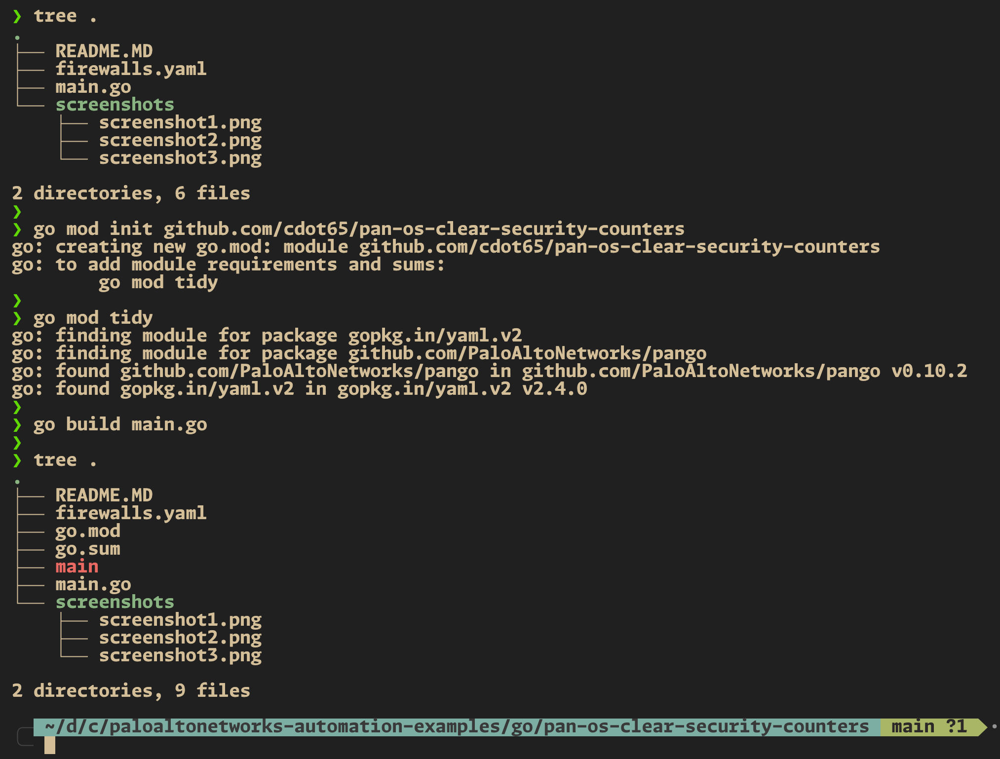
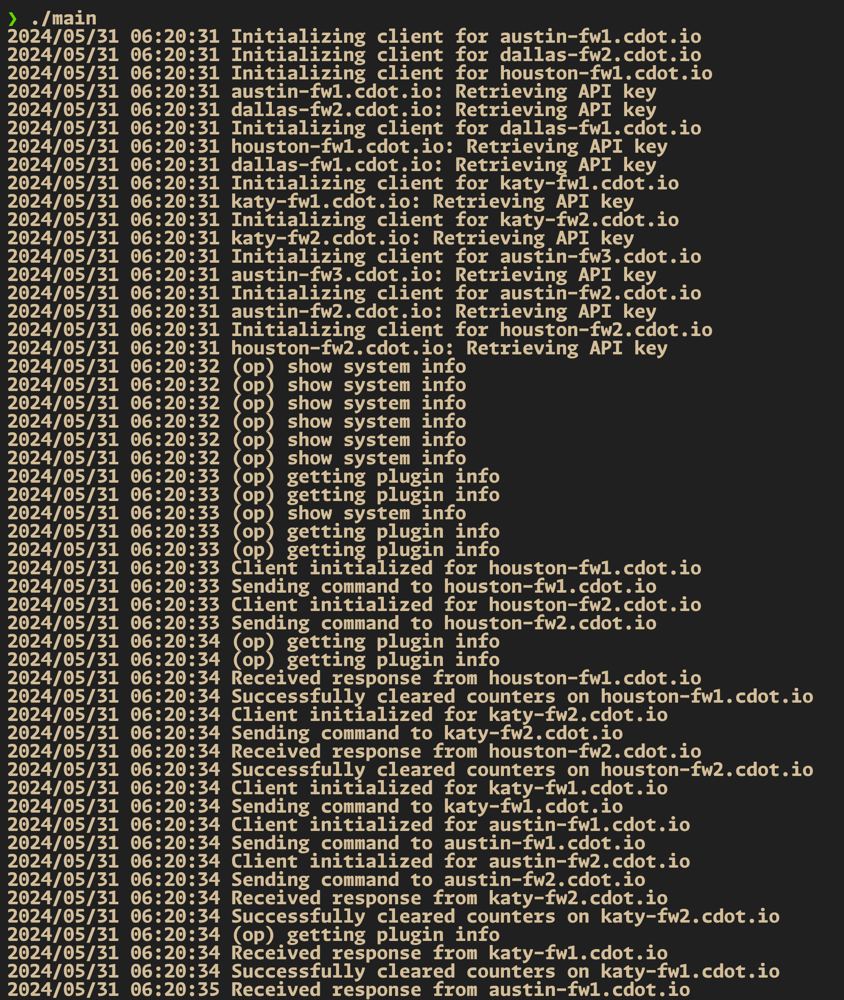
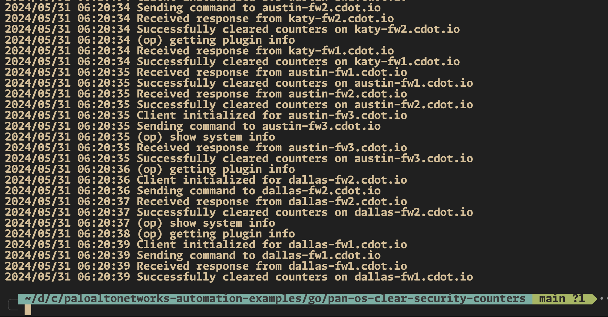

# Firewall Counter Clearer 📚

This README provides an overview of our Go project and guides you through the setup and execution process. 🚀

## Table of Contents

- [Firewall Counter Clearer 📚](#firewall-counter-clearer-)
	- [Table of Contents](#table-of-contents)
	- [Overview](#overview)
	- [Prerequisites](#prerequisites)
	- [Setup](#setup)
		- [Creating a Go Environment](#creating-a-go-environment)
		- [Installing Dependencies](#installing-dependencies)
	- [main.go](#maingo)
	- [Execution Workflow](#execution-workflow)
		- [Screenshots](#screenshots)

## Overview

Our Go project aims to automate the process of clearing all security rule counters on multiple firewalls using their XML API. 🎯

## Prerequisites

Before getting started, ensure that you have the following prerequisites installed on your local machine:

- Go (version 1.20+) 🐹

## Setup

### Creating a Go Environment

To create a Go development environment, follow these steps:

1. Open a terminal and navigate to the project directory.
2. If Go is not already installed, install it from the [official website](https://golang.org/dl/).

### Installing Dependencies

1. Initialize a new Go module for the project:

   ```bash
   go mod init github.com/cdot65/pan-os-clear-counters
   ```

2. Tidy up the `go.mod` file to automatically fetch the dependencies used in the project:

   ```bash
   go mod tidy
   ```

## main.go

Our primary Go file (`main.go`) is structured as follows:

```go
package main

import (
	"encoding/xml"
	"fmt"
	"log"
	"os"
	"sync"

	"github.com/PaloAltoNetworks/pango"
	"gopkg.in/yaml.v2"
)

// Firewall represents the configuration details for a single firewall.
type Firewall struct {
	Hostname string `yaml:"hostname"`
	Username string `yaml:"username"`
	Password string `yaml:"password"`
	APIKey   string `yaml:"api_key"` // Adding API Key for authentication
}

// Config represents the overall configuration containing a list of firewalls.
type Config struct {
	Firewalls []Firewall `yaml:"firewalls"`
}

// Response represents the structure of the XML response from the firewall.
type Response struct {
	Status string `xml:"status,attr"`
	Result string `xml:"result"`
}

func main() {
	var config Config

	// Read the YAML configuration file.
	data, err := os.ReadFile("firewalls.yaml")
	if err != nil {
		log.Fatalf("Failed to read file: %v", err)
	}

	// Unmarshal the YAML file into the config struct.
	err = yaml.Unmarshal(data, &config)
	if err != nil {
		log.Fatalf("Failed to unmarshal YAML: %v", err)
	}

	var wg sync.WaitGroup

	// Iterate over each firewall configuration and start a goroutine to handle each one.
	for _, fw := range config.Firewalls {
		wg.Add(1)
		go func(fw Firewall) {
			defer wg.Done()
			err := clearCounter(fw)
			if err != nil {
				log.Printf("Failed to clear counter on %s: %v", fw.Hostname, err)
			}
		}(fw)
	}

	// Wait for all goroutines to finish.
	wg.Wait()
}

// clearCounter initializes a client for the firewall, sends an API command to clear counters,
// and processes the response.
func clearCounter(fw Firewall) error {
	// Initialize the firewall client.
	client := &pango.Firewall{
		Client: pango.Client{
			Hostname: fw.Hostname,
			Username: fw.Username,
			Password: fw.Password,
			Logging:  pango.LogAction | pango.LogOp, // Enable logging
		},
	}

	log.Printf("Initializing client for %s", fw.Hostname)
	if err := client.Initialize(); err != nil {
		return fmt.Errorf("failed to initialize client: %w", err)
	}
	log.Printf("Client initialized for %s", fw.Hostname)

	// Define the command to clear the counters.
	cmd := "<clear><rule-hit-count><vsys><vsys-name><entry name='vsys1'><rule-base><entry name='security'><rules><all/></rules></entry></rule-base></entry></vsys-name></vsys></rule-hit-count></clear>"
	log.Printf("Sending command to %s", fw.Hostname)
	response, err := client.Op(cmd, "", nil, nil)
	if err != nil {
		return fmt.Errorf("failed to perform op command: %w", err)
	}
	log.Printf("Received response from %s", fw.Hostname)

	// Unmarshal the XML response into the Response struct.
	var resp Response
	if err := xml.Unmarshal([]byte(response), &resp); err != nil {
		return fmt.Errorf("failed to unmarshal response: %w", err)
	}

	// Check the response status.
	if resp.Status != "success" {
		return fmt.Errorf("operation failed: %s", resp.Result)
	}

	log.Printf("Successfully cleared counters on %s", fw.Hostname)
	return nil
}
```

The Go file is structured as follows:

- **Imports**: The package imports several libraries for encoding, concurrency, logging, and external library dependencies (`pango`, `yaml.v2`).

- **Structs**: Defines structs to map the YAML configuration (`Firewall`, `Config`) and the XML response (`Response`).

- **Main Function**: Reads the YAML configuration file and concurrently processes each firewall configuration to clear the counters.

- **clearCounter Function**: Initializes the firewall client, sends the clear counters command, and processes the XML response to ensure the operation completes successfully.

## Execution Workflow

To execute our Go project, follow these steps:

1. Ensure that `firewalls.yaml` is properly configured with the list of firewall devices and credentials.
2. Build and run the Go application:

   ```bash
   go build main.go
   ./main
   ```

   This will read the firewall configurations, send the command to clear the counters for each, and log their responses. 🚀

### Screenshots

Here are some screenshots showcasing the execution:


_initialize the project by building the binary_


_execute by simply pointing to the path of the binary file generated_


_command successfully executed_

Feel free to explore the project and customize it according to your specific requirements. Happy automating! 😄
