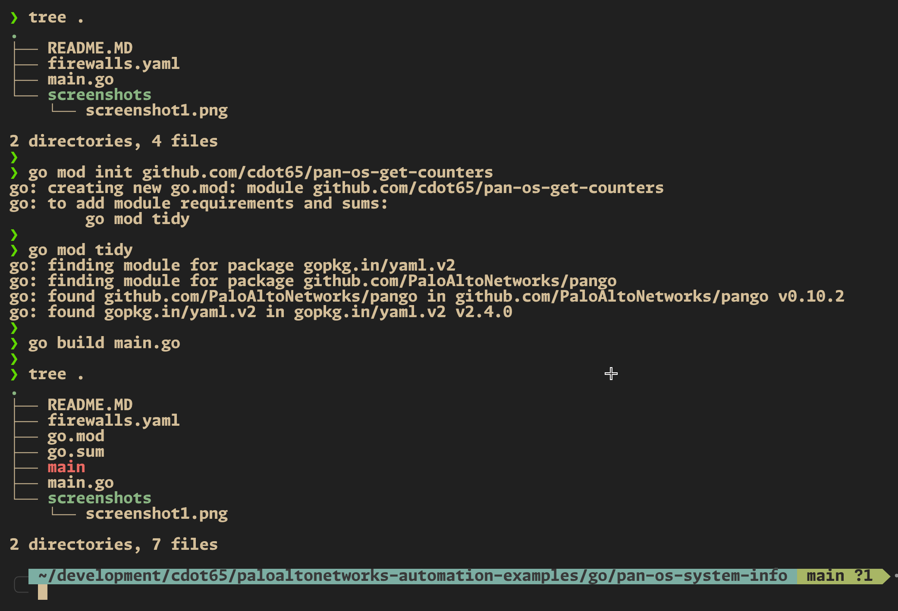
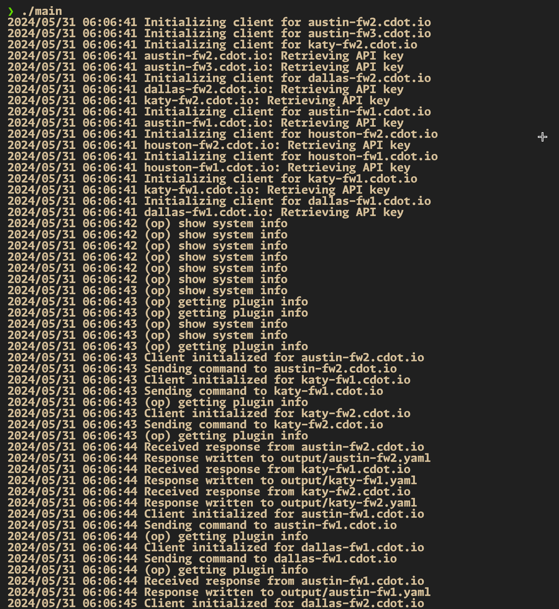
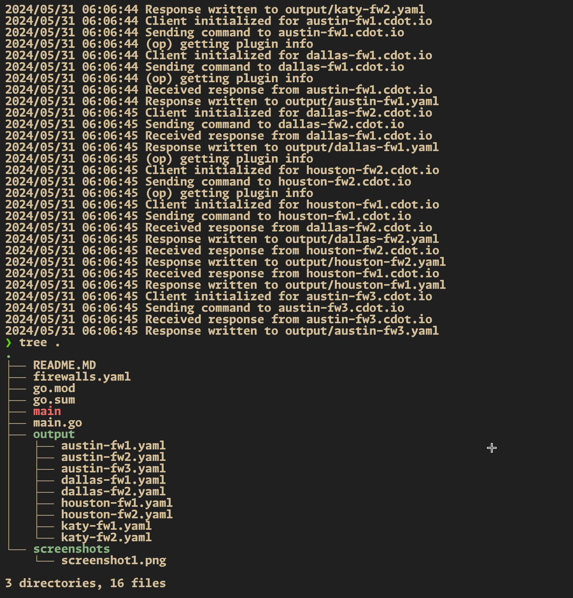

# Firewall Counter Collector 📚

This README provides an overview of our Go project and guides you through the setup and execution process. 🚀

## Table of Contents

- [Firewall Counter Collector 📚](#firewall-counter-collector-)
	- [Table of Contents](#table-of-contents)
	- [Overview](#overview)
	- [Prerequisites](#prerequisites)
	- [Setup](#setup)
		- [Creating a Go Environment](#creating-a-go-environment)
		- [Installing Dependencies](#installing-dependencies)
	- [main.go](#maingo)
	- [Execution Workflow](#execution-workflow)
		- [Screenshots](#screenshots)

## Overview

Our Go project aims to automate the process of collecting counter statistics from multiple firewalls using their XML API, processing the responses, and saving them into YAML files for further analysis. 🎯

## Prerequisites

Before getting started, ensure that you have the following prerequisites installed on your local machine:

- Go (version 1.20+) 🐹

## Setup

### Creating a Go Environment

To create a Go development environment, follow these steps:

1. Open a terminal and navigate to the project directory.
2. If Go is not already installed, install it from the [official website](https://golang.org/dl/).

### Installing Dependencies

1. Initialize a new Go module for the project:

   ```bash
   go mod init github.com/cdot65/pan-os-get-counters
   ```

2. Tidy up the `go.mod` file to automatically fetch the dependencies used in the project:

   ```bash
   go mod tidy
   ```

## main.go

Our primary Go file (`main.go`) is structured as follows:

```go
package main

import (
	"encoding/xml"
	"fmt"
	"log"
	"os"
	"path/filepath"
	"strings"
	"sync"

	"github.com/PaloAltoNetworks/pango"
	"gopkg.in/yaml.v2"
)

// Firewall represents the configuration details for a single firewall.
type Firewall struct {
	Hostname string `yaml:"hostname"`
	Username string `yaml:"username"`
	Password string `yaml:"password"`
}

// Config represents the overall configuration containing a list of firewalls.
type Config struct {
	Firewalls []Firewall `yaml:"firewalls"`
}

// Response represents the structure of the XML response from the firewall.
type Response struct {
	Status string `xml:"status,attr"`
	Result struct {
		Global struct {
			T int `xml:"t"`
			Counters struct {
				Entries []Entry `xml:"entry"`
			} `xml:"counters"`
		} `xml:"global"`
	} `xml:"result"`
}

// Entry represents each counter entry in the response.
type Entry struct {
	Category string `xml:"category"`
	Name     string `xml:"name"`
	Value    int    `xml:"value"`
	Rate     int    `xml:"rate"`
	Aspect   string `xml:"aspect"`
	Desc     string `xml:"desc"`
	ID       int    `xml:"id"`
	Severity string `xml:"severity"`
}

func main() {
	var config Config

	// Read the YAML configuration file.
	data, err := os.ReadFile("firewalls.yaml")
	if err != nil {
		log.Fatalf("Failed to read file: %v", err)
	}

	// Unmarshal the YAML file into the config struct.
	err = yaml.Unmarshal(data, &config)
	if err != nil {
		log.Fatalf("Failed to unmarshal YAML: %v", err)
	}

	// Ensure the output directory exists.
	outputDir := "output"
	if err := os.MkdirAll(outputDir, 0755); err != nil {
		log.Fatalf("Failed to create output directory: %v", err)
	}

	var wg sync.WaitGroup

	// Iterate over each firewall configuration and start a goroutine to handle each one.
	for _, fw := range config.Firewalls {
		wg.Add(1)
		go func(fw Firewall) {
			defer wg.Done()
			err := getCounter(fw, outputDir)
			if err != nil {
				log.Printf("Failed to get counter from %s: %v", fw.Hostname, err)
			}
		}(fw)
	}

	// Wait for all goroutines to finish.
	wg.Wait()
}

// getCounter initializes a client for the firewall, sends an API command, processes the response,
// and writes the response to a YAML file named after the device's hostname in the output directory.
func getCounter(fw Firewall, outputDir string) error {
	// Initialize the firewall client.
	client := &pango.Firewall{
		Client: pango.Client{
			Hostname: fw.Hostname,
			Username: fw.Username,
			Password: fw.Password,
			Logging:  pango.LogAction | pango.LogOp, // Enable logging
		},
	}

	log.Printf("Initializing client for %s", fw.Hostname)
	if err := client.Initialize(); err != nil {
		return fmt.Errorf("failed to initialize client: %w", err)
	}
	log.Printf("Client initialized for %s", fw.Hostname)

	// Define the command to be sent to the firewall.
	cmd := "<show><counter><global/></counter></show>"
	log.Printf("Sending command to %s", fw.Hostname)
	response, err := client.Op(cmd, "", nil, nil)
	if err != nil {
		return fmt.Errorf("failed to perform op command: %w", err)
	}
	log.Printf("Received response from %s", fw.Hostname)

	// Unmarshal the XML response into the Response struct.
	var resp Response
	if err := xml.Unmarshal([]byte(response), &resp); err != nil {
		return fmt.Errorf("failed to unmarshal response: %w", err)
	}

	// Extract the hostname without the domain name to use as the filename.
	hostname := strings.Split(fw.Hostname, ".")[0]
	filename := filepath.Join(outputDir, fmt.Sprintf("%s.yaml", hostname))

	// Marshal the response struct to YAML.
	yamlData, err := yaml.Marshal(resp)
	if err != nil {
		return fmt.Errorf("failed to marshal response to YAML: %w", err)
	}

	// Write the YAML data to a file in the output directory.
	err = os.WriteFile(filename, yamlData, 0644)
	if err != nil {
		return fmt.Errorf("failed to write YAML file: %w", err)
	}

	log.Printf("Response written to %s", filename)
	return nil
}
```

The Go file is structured as follows:

- **Imports**: The package imports several libraries for encoding, concurrency, logging, and external library dependencies (`pango`, `yaml.v2`).

- **Structs**: Defines structs to map the YAML configuration (`Firewall`, `Config`) and the XML response (`Response`, `Entry`).

- **Main Function**: Reads the YAML configuration file, creates the output directory, and concurrently processes each firewall configuration.

- **getCounter Function**: Initializes the firewall client, sends the counter command, processes the XML response, and writes the response to a YAML file.

## Execution Workflow

To execute our Go project, follow these steps:

1. Ensure that `firewalls.yaml` is properly configured with the list of firewall devices and credentials.
2. Build and run the Go application:

   ```bash
   go build main.go
   ./main
   ```

   This will read the firewall configurations, send the command to each, process their responses, and save the output into YAML files in the `output` directory. 🚀

### Screenshots

Here are some screenshots showcasing the execution:


_initialize the project by building the binary_


_execute by simply pointing to the path of the binary file generated_


_a new folder called "output" is created, with the command output formatted in YAML files_

Feel free to explore the project and customize it according to your specific requirements. Happy automating! 😄
