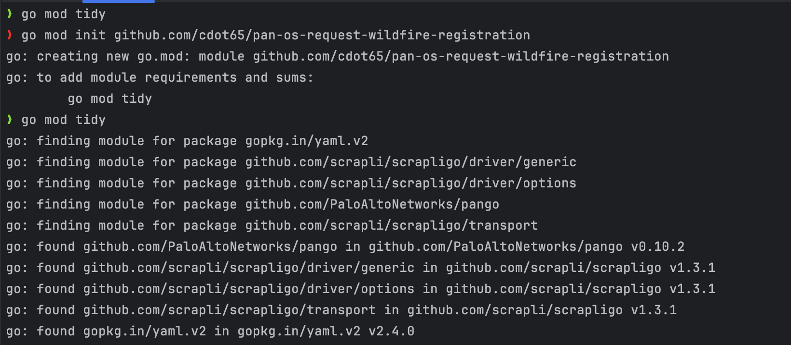
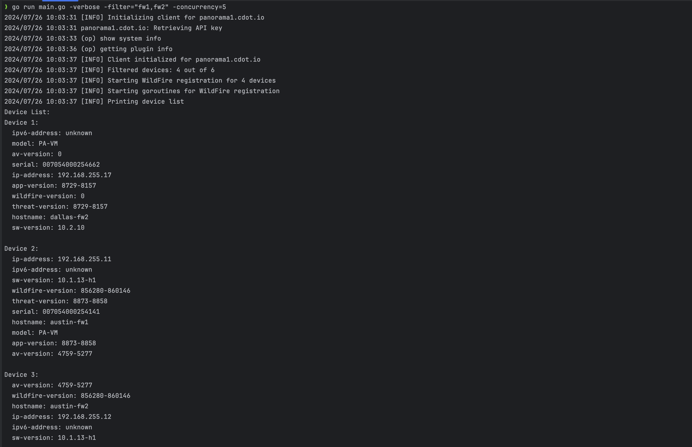

# WildFire Registration Script

This Go script automates the process of registering WildFire on Palo Alto Networks firewalls managed by Panorama or specified in a local inventory file.

## Features

- Connects to Panorama to retrieve a list of connected devices
- Optionally uses a local inventory file instead of querying Panorama
- Filters devices based on hostname patterns (when using Panorama)
- Concurrently registers WildFire on multiple firewalls
- Customizable concurrency level
- Verbose logging option for debugging

## Prerequisites

- Go 1.16 or higher
- Access to a Panorama instance (if not using local inventory)
- Firewall credentials

## Installation

1. Clone this repository:

    ```
    git clone https://github.com/cdot65/paloaltonetworks-automation-examples.git
    cd go/pan-os-request-wildfire-registration
    ```
   
2. Initialize the project

   ```
   go mod init github.com/yourusernamehere/pan-os-request-wildfire-registration
   ```

3. Install the required dependencies:

    ```
    go mod tidy
    ```

## Configuration

1. Create a `panorama.yaml` file with your Panorama configuration:

    ```yaml
    panorama:
      - hostname: your-panorama-hostname
    ```

2. Create a `.secrets.yaml` file with your authentication details:

    ```yaml
    auth:
      panorama:
        username: your-panorama-username
        password: your-panorama-password
      firewall:
        username: your-firewall-username
        password: your-firewall-password
    ```

3. (Optional) Create an `inventory.yaml` file with your firewall details:

    ```yaml
    inventory:
      - hostname: 'firewall-1'
        ip_address: '192.168.1.1'
      - hostname: 'firewall-2'
        ip_address: '192.168.1.2'
    ```

## Usage

Run the script with the following command:

```
go run main.go [flags]
```

Available flags:

- `-debug int`: Debug level: 0=INFO, 1=DEBUG (default 0)
- `-concurrency int`: Number of concurrent operations (default: number of CPUs)
- `-config string`: Path to the Panorama configuration file (default "panorama.yaml")
- `-secrets string`: Path to the secrets file (default ".secrets.yaml")
- `-filter string`: Comma-separated list of hostname patterns to filter devices (only works when querying Panorama)
- `-verbose`: Enable verbose logging
- `-nopanorama`: Use inventory.yaml instead of querying Panorama

Examples:

1. Using Panorama with filtering:
```
go run main.go -verbose -filter="fw1,fw2" -concurrency=5
```

2. Using local inventory:
```
go run main.go -verbose -nopanorama
```

Note: When using the `-nopanorama` flag, the script will load firewall information from `inventory.yaml` instead of querying Panorama. In this case, the `-filter` flag has no effect.

## Inventory File

When using the `-nopanorama` flag, the script reads firewall information from `inventory.yaml`. This file should be in the following format:

```yaml
inventory:
  - hostname: 'firewall-1'
    ip_address: '192.168.1.1'
  - hostname: 'firewall-2'
    ip_address: '192.168.1.2'
  - hostname: 'firewall-3'
    ip_address: '192.168.1.3'
```

## Output

The script will display:

1. A list of all devices (either from Panorama or the inventory file)
2. WildFire registration results for each device
3. A summary of successful and failed registrations

### Screenshots

Here are some screenshots showcasing the execution:

_initialize the project by building the binary_


_execute by simply pointing to the path of the binary file generated_



_bypass Panorama and use a statically defined inventory.yaml file as source of inventory_


## Error Handling

- The script will log errors for failed connections or registrations
- A timeout is set for each device registration to prevent indefinite hanging

## Contributing

Contributions are welcome! Please feel free to submit a Pull Request.

## License

This project is licensed under the MIT License - see the LICENSE file for details.
