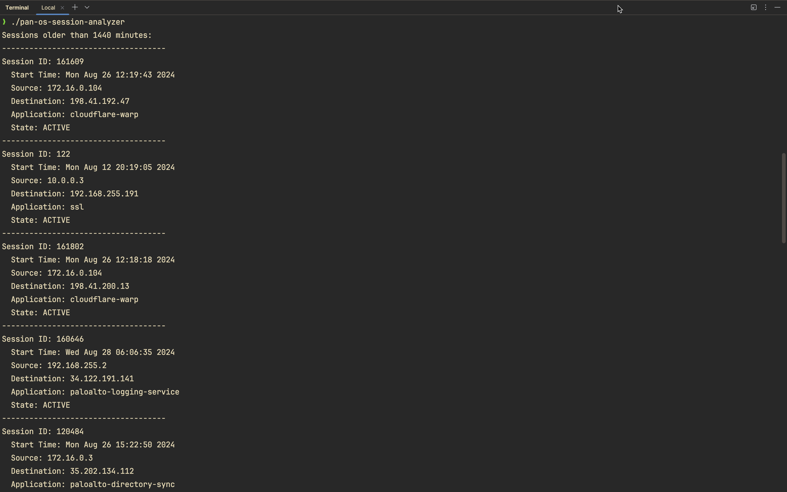

# PAN-OS Session Viewer

This Go script retrieves and displays session information from Palo Alto Networks firewalls.

## Table of Contents

- [Features](#features)
- [Prerequisites](#prerequisites)
- [Quick Start](#quick-start)
- [Installation from Source](#installation-from-source)
- [Configuration](#configuration)
- [Usage](#usage)
- [Output](#output)
- [Contributing](#contributing)
- [License](#license)

## Features

- Connects to a Palo Alto Networks firewall using API
- Retrieves all active sessions
- Filters sessions older than a specified duration
- Displays detailed information for filtered sessions

## Prerequisites

- Go 1.20 or higher
- Access to a Palo Alto Networks firewall
- API key for the firewall

## Quick Start

1. Download the pre-compiled binary for your host machine from the [Releases](https://github.com/cdot65/pan-os-session-analyzer/releases) page.

2. Create a `settings.yaml` file in the same directory as the binary:

    ```yaml
    hostname: your-firewall-hostname
    minutes: 1440  # 24 hours in minutes
    ```

3. Create a `.secrets.yaml` file in the same directory as the binary:

    ```yaml
    api_key: your-api-key-here
    ```

4. Run the binary:

    ```
    ./pan-os-session-analyzer
    ```

## Installation from Source

1. Clone this repository:

    ```
    git clone https://github.com/cdot65/paloaltonetworks-automation-examples.git
    cd paloaltonetworks-automation-examples/go/pan-os-session-analyzer
    ```

2. Build the binary:

    ```
    go mod init github.com/cdot65/pan-os-session-analyzer
    go mod tidy
    go build -o pan-os-session-analyzer
    ```

3. Create the required configuration files as described in the [Configuration](#configuration) section.

4. Run the binary:

    ```
    ./pan-os-session-analyzer
    ```

## Configuration

1. Create a `settings.yaml` file with your firewall configuration:

    ```yaml
    hostname: your-firewall-hostname
    minutes: 1440  # 24 hours in minutes
    ```

2. Create a `.secrets.yaml` file with your API key:

    ```yaml
    api_key: your-api-key-here
    ```

## Usage

Run the script with the following command:

    ```
    ./pan-os-session-analyzer
    ```

## Output

The script will display:

1. A list of sessions older than the specified duration
2. Detailed information for each session, including:
   - Session ID
   - Start Time
   - Source
   - Destination
   - Application
   - State

## Screenshots

Here are some screenshots showcasing the execution:


_execute the binary_


## Contributing

Contributions are welcome! Please feel free to submit a Pull Request.

## License

This project is licensed under the MIT License - see the LICENSE file for details.