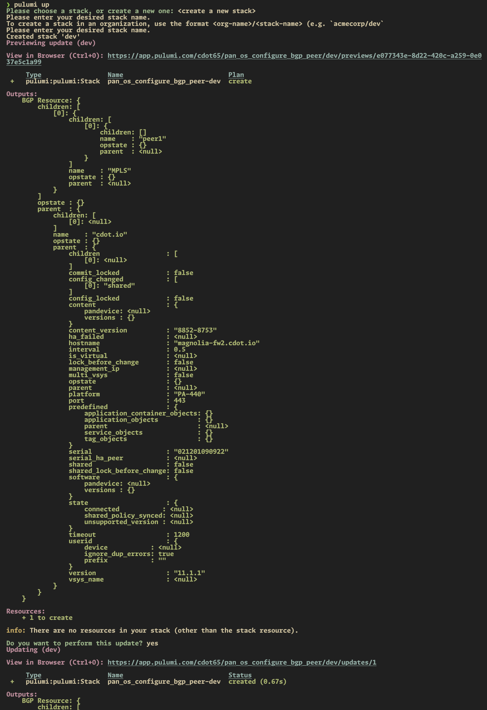
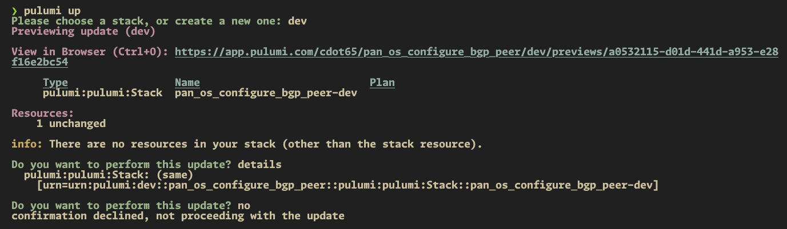

# PAN-OS BGP Peer Configuration Project 📚

This README provides an overview of our Python-based Pulumi project and guides you through the setup and execution process. 🚀

## Table of Contents

- [PAN-OS BGP Peer Configuration Project 📚](#pan-os-bgp-peer-configuration-project-)
  - [Table of Contents](#table-of-contents)
  - [Overview](#overview)
  - [Prerequisites](#prerequisites)
    - [Environment Variables](#environment-variables)
  - [Setup](#setup)
    - [Creating a Python Virtual Environment](#creating-a-python-virtual-environment)
    - [Installing Dependencies](#installing-dependencies)
  - [Pulumi](#pulumi)
    - [Pulumi 101](#pulumi-101)
    - [Configuration File](#configuration-file)
    - [Script Structure](#script-structure)
  - [Execution Workflow](#execution-workflow)
  - [Screenshots](#screenshots)

## Overview

Our Python-based Pulumi project aims to automate the configuration and deployment of BGP peers on a PAN-OS firewall. By leveraging Pulumi's powerful declarative automation capabilities, we can streamline the process and ensure consistent and reproducible results across multiple environments. 🎯

## Prerequisites

Before getting started, ensure that you have the following prerequisites installed on your local machine:

- Python (version 3.11+) 🐍
- pip (Python package manager) 📦
- Pulumi CLI ⛏

### Environment Variables

Make sure to set the `PANOS_PASSWORD` environment variable to avoid storing sensitive information in configuration files.

```bash
export PANOS_PASSWORD=<your-pan-os-password>
```

## Setup

### Creating a Python Virtual Environment

To create a Python virtual environment, follow these steps:

1. Open a terminal and navigate to the project directory.
2. Run the following command to create a virtual environment:

   ```bash
   python -m venv venv
   ```

3. Activate the virtual environment:

   - For Windows:

     ```bash
     venv\Scripts\activate
     ```

   - For macOS and Linux:

     ```bash
     source venv/bin/activate
     ```

### Installing Dependencies

Once the virtual environment is activated, install the required Python packages from the `requirements.txt` file:

```bash
pip install -r requirements.txt
```

## Pulumi

### Pulumi 101

Pulumi is an open-source infrastructure as code tool that allows you to define and manage cloud resources using real programming languages. It supports multiple programming languages and cloud providers, making it a versatile choice for infrastructure management.

Common workflows with Pulumi include:

- **Defining Infrastructure**: Write code to define the desired state of your infrastructure.
- **Deployment**: Use `pulumi up` to create or update resources in your cloud environment.
- **Management**: Use `pulumi stack` to manage different environments and configurations.
- **Teardown**: Use `pulumi destroy` to delete resources and clean up the environment.

### Configuration File

Pulumi looks for configuration files to manage settings across different environments. These configuration files are ingested into the script and structured in YAML format. The configuration values can be provided per stack, ensuring isolated environments.

In our project, the configuration file (`Pulumi.dev.yaml`) contains:

```yaml
config:
  pan_os_configure_bgp_peer:hostname: "example-firewall.example.com"
  pan_os_configure_bgp_peer:username: "automation"
  pan_os_configure_bgp_peer:vr_name: "default-vr"
  pan_os_configure_bgp_peer:router_id: "172.16.255.1"
  pan_os_configure_bgp_peer:local_as: 65000
  pan_os_configure_bgp_peer:bgp_name: "MPLS"
  pan_os_configure_bgp_peer:neighbors:
    - name: "peer1"
      asn: 65001
      iface: "ethernet1/8"
      local_ip: "10.10.10.1/24"
      peer_ip: "10.10.10.2"
```

### Script Structure

Our Python script (`__main__.py`) is structured as follows:

```python
# standard library imports
import os

# pulumi imports
import pulumi
from pulumi import Config, export

# pan-os imports
from panos.firewall import Firewall
from panos.network import VirtualRouter, Bgp, BgpPeer, BgpPeerGroup


# Load configuration settings
config = Config()

hostname = config.require("hostname")
username = config.require("username")
vr_name = config.require("vr_name")
router_id = config.require("router_id")
local_as = config.require("local_as")
bgp_name = config.require("bgp_name")
neighbors = config.require_object("neighbors")

# Load password from environment variable
password = os.environ.get("PANOS_PASSWORD")


# Function to configure BGP on the firewall
def configure_bgp(firewall):
    dc_vr = VirtualRouter(name=vr_name)
    firewall.add(dc_vr)

    dc_bgp = Bgp(
        enable=True,
        router_id=router_id,
        local_as=local_as,
    )
    dc_vr.add(dc_bgp)
    dc_bgp.apply()

    dc_bgp_peer_group = BgpPeerGroup(
        enable=True,
        soft_reset_with_stored_info=True,
        type="ebgp",
        name=bgp_name,
    )
    dc_bgp.add(dc_bgp_peer_group)

    for each in neighbors:
        each_bgp_peer = BgpPeer(
            name=each["name"],
            enable=True,
            peer_as=each["asn"],
            address_family_identifier="ipv4",
            local_interface=each["iface"],
            local_interface_ip=each["local_ip"],
            peer_address_ip=each["peer_ip"],
        )
        dc_bgp_peer_group.add(each_bgp_peer)
        each_bgp_peer.apply()

    return dc_bgp


# Define the Pulumi program
def pulumi_program():
    firewall = Firewall(
        hostname,
        api_username=username,
        api_password=password,
    )

    bgp_resource = configure_bgp(firewall)
    pulumi.export("BGP Resource", bgp_resource)


# Run the Pulumi program
pulumi_program()

```

In summary, the script configures BGP on a PAN-OS firewall by reading configuration data and using the pan-os-python SDK for interaction.

## Execution Workflow

To execute our Python script, follow these steps:

1. Ensure that you have activated the Python virtual environment.
2. Ensure that the `PANOS_PASSWORD` environment variable is set.
3. Run the following command to initialize the Pulumi stack and deploy the resources:

   ```bash
   pulumi up
   ```

4. To destroy the resources and clean up the environment, use:

   ```bash
   pulumi destroy
   ```

5. To remove the Pulumi stack, use:

   ```bash
   pulumi stack rm <stack-name>
   ```

## Screenshots

Here are some screenshots showcasing the execution of our Python script:




Feel free to explore the script and customize it according to your specific requirements. Happy automating! 😄
