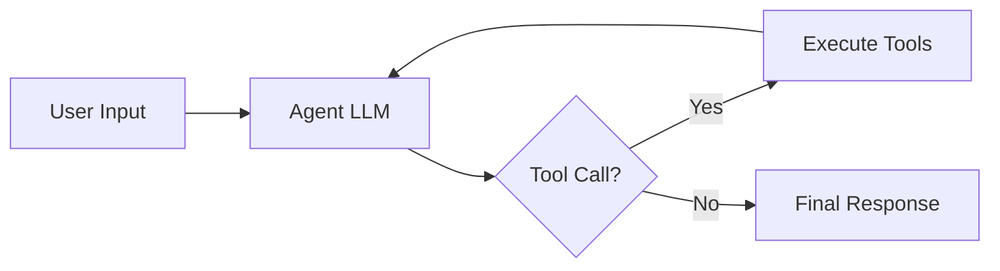
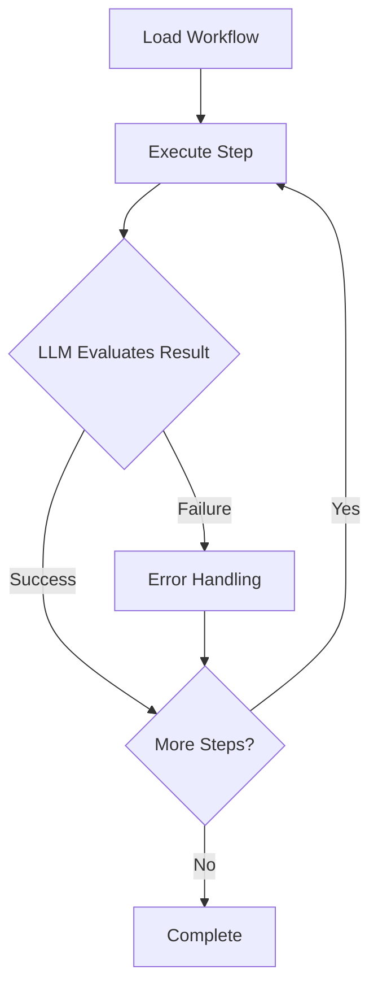

# PAN-OS LangGraph Agent

AI agent for automating Palo Alto Networks PAN-OS firewalls using natural language. Built with LangGraph and pan-os-python.

## Overview

This project demonstrates two approaches to AI-driven network automation:

| Mode | Description | Use Case |
|------|-------------|----------|
| **Autonomous** | ReAct agent with full tool access | Exploratory automation, ad-hoc tasks, natural language queries |
| **Deterministic** | Step-by-step workflows with conditional routing | Production workflows, repeatable processes, Ansible-like execution |

### Key Features

- 🤖 **Dual-mode operation**: Autonomous (ReAct) and Deterministic (workflow-based)
- 🔧 **Comprehensive PAN-OS support**: 34 tools across addresses, services, policies, NAT
- ⚡ **Parallel batch operations**: 4-10x speedup with automatic dependency resolution
- 🎯 **LangGraph Studio integration**: Visual debugging and execution
- 🔄 **Retry logic**: Exponential backoff for transient failures
- 🏗️ **Composable subgraphs**: CRUD, batch, commit workflows
- 📝 **Firewall commits**: Job polling with approval gates
- 🔗 **Dependency resolver**: Topological sorting prevents reference errors

## Quickstart

### 1. Prerequisites

- Python 3.11+ (managed via pyenv)
- uv package manager
- PAN-OS firewall (tested on 10.x+)
- Anthropic API key

### 2. Setup

```bash
# Install Python 3.11
pyenv install 3.11
pyenv local 3.11

# Create virtual environment with uv
uv venv
source .venv/bin/activate  # On Windows: .venv\Scripts\activate

# Install dependencies
uv pip install -e .

# Configure environment
cp .env.example .env
# Edit .env with your credentials
```

### 3. Environment Variables

```bash
# Required
PANOS_HOSTNAME=192.168.1.1
PANOS_USERNAME=admin
PANOS_PASSWORD=your_password
ANTHROPIC_API_KEY=sk-ant-your-key-here

# Optional
DEFAULT_MODE=autonomous
LOG_LEVEL=INFO
```

### 4. Run with LangGraph Studio

```bash
# Start LangGraph Studio
langgraph dev

# Or via CLI command (once implemented)
panos-agent studio
```

Then open `http://localhost:8000` and select a graph (autonomous or deterministic).

### 5. CLI Usage

```bash
# Autonomous mode (natural language)
panos-agent run -m autonomous -p "Create address object web-server at 10.1.1.100"
panos-agent run -m autonomous -p "List all service groups"

# Deterministic mode (predefined workflows)
panos-agent list-workflows  # Show all available workflows
panos-agent run -m deterministic -p "simple_address"
panos-agent run -m deterministic -p "web_server_setup"
panos-agent run -m deterministic -p "security_rule_complete"

# Test connection
panos-agent test-connection

# Version info
panos-agent version
```

## Architecture

### Project Structure

```
panos-agent/
├── src/
│   ├── autonomous_graph.py      # ReAct agent graph
│   ├── deterministic_graph.py   # Workflow graph
│   ├── main.py                  # Graph orchestrator
│   ├── core/
│   │   ├── client.py            # PAN-OS firewall client
│   │   ├── config.py            # Environment config
│   │   ├── state_schemas.py     # All state definitions
│   │   ├── retry_helper.py      # Retry logic
│   │   └── subgraphs/
│   │       ├── crud.py          # Single object operations
│   │       ├── batch.py         # Parallel batch operations
│   │       ├── commit.py        # Commit workflow
│   │       └── deterministic.py # Workflow executor
│   ├── tools/
│   │   ├── address_objects.py
│   │   ├── services.py
│   │   ├── security_policies.py
│   │   ├── nat_policies.py
│   │   └── orchestration/
│   │       ├── crud_operations.py
│   │       └── batch_operations.py
│   └── cli/
│       └── commands.py
├── tests/
├── docs/
│   └── ARCHITECTURE.md
├── langgraph.json               # LangGraph Studio config
├── pyproject.toml
└── README.md
```

### Autonomous Mode

ReAct pattern: **agent → tools → agent** loop.



**Use cases:**
- "Show me all address objects"
- "Create security rule allowing web traffic from Trust to Untrust"
- "Find unused address groups and delete them"

### Deterministic Mode

Step-by-step workflow with conditional routing.



**Use cases:**
- Pre-defined security rule creation workflow
- Multi-step object provisioning
- Repeatable, auditable operations

**Key features:**
- **LLM-based conditional routing**: Agent evaluates each step result
- **HITL approval gates**: Human approval required at critical points
- **Sequential execution**: Predictable, step-by-step workflow
- **Error handling**: Stops on critical errors with detailed reporting

**Available workflows** (9 total):

*Basic workflows:*
- `simple_address`: Create and verify single address object
- `address_with_approval`: Address creation with approval gate
- `web_server_setup`: Multi-object creation (addresses, services, groups)
- `multi_address_creation`: Multiple addresses with grouping
- `network_segmentation`: Complete network segment setup
- `security_rule_complete`: End-to-end security rule with dependencies

*Batch & Advanced workflows:*
- `batch_address_creation`: Parallel creation of 10 addresses (4-10x faster)
- `batch_with_dependencies`: Auto-resolves dependencies (groups → addresses)
- `complete_security_workflow`: Full workflow with batch ops + commit

## Development Status

### ✅ Phase 1: Foundation (Completed)

- [x] Python/uv setup
- [x] Project structure
- [x] Core modules (config, client, state_schemas, retry_helper)
- [x] LangGraph Studio configuration

### ✅ Phase 2: Tools & Subgraphs (Completed)

- [x] PAN-OS tools (22 tools: addresses, services, groups)
- [x] CRUD subgraph
- [x] Orchestration tools (crud_operation)

### ✅ Phase 3: Dual-Mode Graphs (Completed)

- [x] Autonomous graph implementation (ReAct agent)
- [x] Deterministic graph implementation (workflow executor)
- [x] CLI commands (run, list-workflows, test-connection, studio)
- [x] 6 basic workflows with approval gates

### ✅ Phase 4: Advanced Features (Completed)

- [x] **Dependency resolver**: Topological sorting for cross-object references
- [x] **Batch subgraph**: Parallel execution with Send API (4-10x speedup)
- [x] **Commit subgraph**: PAN-OS commit with job polling and approval gates
- [x] **Expanded policy tools**: Security policy full CRUD (5 tools)
- [x] **NAT policy tools**: Basic NAT CRUD (4 tools)
- [x] **Orchestration tools**: batch_operation, commit_changes
- [x] **3 advanced workflows**: Batch creation, dependencies, complete workflow
- [x] **Total: 34 tools** across all categories

### ✅ Phase 5: Testing & Polish (Completed)

- [x] **Pre-commit hooks**: black, flake8, isort auto-formatting
- [x] **Pytest configuration**: Test framework setup with fixtures
- [x] **Unit tests**: Dependency resolver (100% coverage)
- [x] **Mock fixtures**: Firewall, objects, sample data
- [x] **ARCHITECTURE.md**: Comprehensive technical guide
- [x] **SETUP.md**: Development environment guide
- [x] **Code quality**: Linting and formatting standards

## Documentation

### 📚 For Developers

- **[ARCHITECTURE.md](docs/ARCHITECTURE.md)**: Complete technical architecture guide
  - **ReAct vs Deterministic comparison**: Detailed workflows, structures, decision-making
  - State management patterns
  - Subgraph design (CRUD, Batch, Commit, Deterministic)
  - Dependency resolution algorithm
  - Testing strategy
  - Troubleshooting guide

- **[SETUP.md](docs/SETUP.md)**: Development environment setup
  - Installation steps
  - IDE configuration
  - Development workflow
  - Pre-commit hooks
  - Common issues

### 🎓 For Users

- **README.md** (this file): Overview and quickstart
- **Workflows**: See `panos-agent list-workflows`
- **LangGraph Studio**: Run `langgraph dev` for visual interface

## Contributing

This is a standalone example project within the broader `paloaltonetworks-automation-examples` repository.

## License

See repository root for license information.

## Resources

- [LangGraph Documentation](https://langchain-ai.github.io/langgraph/)
- [pan-os-python Documentation](https://pan-os-python.readthedocs.io/)
- [PAN-OS XML API Reference](https://docs.paloaltonetworks.com/pan-os/11-0/pan-os-panorama-api)

---

**Status**: ✅ Complete (All 5 phases)
**Features**: 34 tools, batch ops, commit workflow, 9 workflows, pre-commit hooks, comprehensive docs
**Coverage**: Unit tests, architecture guide, setup guide
**Last Updated**: 2025-11-07
