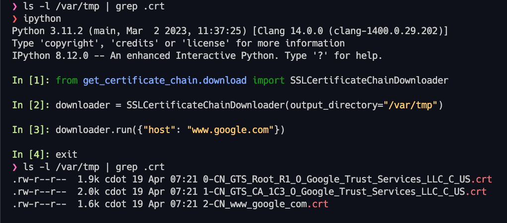
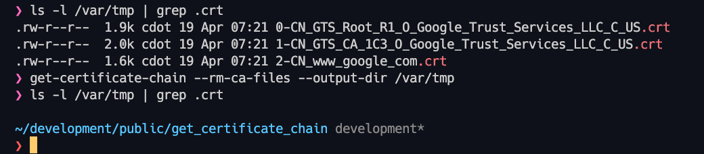

# Get Certificate Chain 🌐🔐

[](https://github.com/cdot65/get_certificate_chain/actions/workflows/tests.yml)

This Python script retrieves the certificate chain from a website, allowing you to analyze and verify the SSL/TLS certificates of the website. This project is a custom fork of the [getCertificateChain project](https://github.com/TheScriptGuy/getCertificateChain), and the overwhelming majority of credit goes to [TheScriptGuy](https://github.com/TheScriptGuy).

## Table of Contents

- [Get Certificate Chain 🌐🔐](#get-certificate-chain-)
  - [Table of Contents](#table-of-contents)
  - [Overview](#overview)
  - [Prerequisites](#prerequisites)
  - [Installation](#installation)
    - [PyPi](#pypi)
    - [GitHub](#github)
  - [Usage 🚀](#usage-)
    - [Import into Script](#import-into-script)
    - [Command Line CLI](#command-line-cli)
      - [Arguments](#arguments)
  - [Contributing](#contributing)
  - [License](#license)

## Overview

Our Python project aims to automate the retrieval and analysis of SSL/TLS certificate chains from websites. By leveraging Python's powerful automation capabilities, we can streamline the process of verifying and examining certificates to ensure consistent and reproducible security checks across multiple environments. 🎯

## Prerequisites

Before getting started, ensure that you have the following prerequisites installed on your local machine:

- Python (version 3.11+) 🐍
- Poetry (optional) - [Python Poetry](https://python-poetry.org/docs/)

## Installation

### PyPi

To install the package from PyPi, simply run the appropriate command:

```bash
pip install get-certificate-chain
```

### GitHub

To install from the GitHub repository, follow these steps:

1. Clone the repository.
2. Change the directory to the cloned repository.
3. Install the package using pip.

```bash
git clone https://github.com/cdot65/get_certificate_chain.git
cd get_certificate_chain
pip install .
```

## Usage 🚀

### Import into Script

To use the package in your script, simply import the package and create an instance of the `SSLCertificateChainDownloader` object.

To pass arguments into the object, you can use the `argparse` library:

1. Import the argparse library.
2. Import the SSLCertificateChainDownloader object from the package.
3. Create a Python dictionary with the "host" key and value of the domain.
4. Create an instance of the SSLCertificateChainDownloader object.
5. Run the downloader object with the parsed arguments.

```python
from get_certificate_chain.download import SSLCertificateChainDownloader

downloader = SSLCertificateChainDownloader()
# Use the downloader object for your needs
```

You can pass the arguments directly into the object:

```python
from get_certificate_chain.download import SSLCertificateChainDownloader

downloader = SSLCertificateChainDownloader()
downloader.run({'host': 'www.google.com'})
```



Or you can use the `argparse` library to parse the arguments:

```python
import argparse
from get_certificate_chain.download import SSLCertificateChainDownloader

parser = argparse.ArgumentParser()
# Add your arguments
args = parser.parse_args()

downloader = SSLCertificateChainDownloader()
downloader.run(args)
```

You may also specify an output directory when creating an instance of the class:

```python
from get_certificate_chain.download import SSLCertificateChainDownloader

downloader = SSLCertificateChainDownloader(output_directory="/var/tmp")
downloader.run({"host": "www.google.com"})
```

### Command Line CLI

To use the script from the command line, run the following command:

```bash
get-certificate-chain --host www.google.com
```


```bash
get-certificate-chain --rm-ca-files
```



#### Arguments

- `--host`: The host:port pair that the script should connect to. Defaults to www.google.com:443.
- `--rm-ca-files`: Remove the certificate files in the current working directory (`*.crt`, `*.pem`).
- `--get-ca-cert-pem`: Get cacert.pem from the curl.se website to help find Root CA.
- `--log-level`: Set the log level. Defaults to INFO.
- `--output-dir`: Set the output directory. Defaults to the current working directory.

## Contributing

Contributions are welcome! To contribute, please follow these guidelines:

1. Write tests for your code using `pytest`. Make sure your tests follow the standards set by the existing tests.
2. Set up a virtual environment using `Poetry`. You can install Poetry by following the instructions at [Python Poetry](https://python-poetry.org/docs/#installation).

To set up a new virtual environment for the project, run the appropriate command:

```bash
poetry install
```

To activate the virtual environment, run the appropriate command:

```bash
poetry shell
```

After making your changes and adding tests, ensure that all tests pass by running the appropriate command:

```bash
pytest
```

## License

This project is licensed under the MIT License - see the [LICENSE](LICENSE) file for details.

Feel free to explore the script and customize it according to your specific requirements. Happy automating! 😄