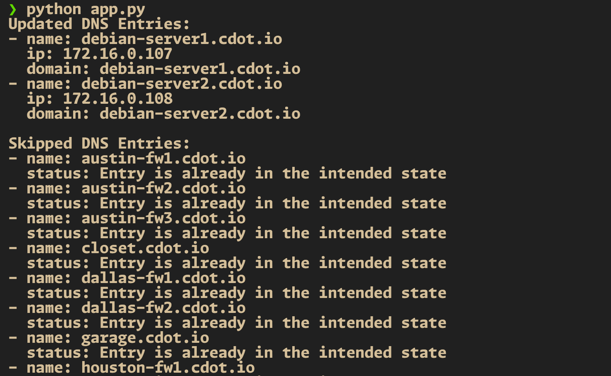

# PAN-Create-Static-DNS-Entries 📚

This README provides an overview of our Python project and guides you through the setup and execution process for creating and updating static DNS entries on a PAN-OS firewall using the `pan-create-static-dns-entries` script. 🚀

## Table of Contents

- [PAN-Create-Static-DNS-Entries 📚](#pan-create-static-dns-entries-)
  - [Table of Contents](#table-of-contents)
  - [Overview](#overview)
  - [Prerequisites](#prerequisites)
  - [Setup](#setup)
    - [Creating a Python Virtual Environment](#creating-a-python-virtual-environment)
    - [Installing Python Packages](#installing-python-packages)
  - [Script Structure](#script-structure)
  - [Execution Workflow](#execution-workflow)
    - [Screenshots](#screenshots)

## Overview

Our Python project aims to automate the configuration and updating of static DNS entries on a PAN-OS firewall. By leveraging Python's powerful automation capabilities, we can streamline the process and ensure consistent and reproducible results across multiple environments. 🎯

## Prerequisites

Before getting started, ensure that you have the following prerequisites installed on your local machine:

- Python (version 3.11+) 🐍
- pip (Python package manager) 📦

## Setup

### Creating a Python Virtual Environment

To create a Python virtual environment, follow these steps:

1. Open a terminal and navigate to the project directory.
2. Run the following command to create a virtual environment:

    ```bash
    python -m venv venv
    ```

3. Activate the virtual environment:
    - For Windows:

      ```bash
      venv\Scripts\activate
      ```

    - For macOS and Linux:

      ```bash
      source venv/bin/activate
      ```

### Installing Python Packages

To install the required Python packages within our virtual environment, run the following command:

```bash
pip install -r requirements.txt
```

## Script Structure

Our Python script (`pan-create-static-dns-entries.py`) is structured as follows:

```python
# standard library modules
import requests
import urllib3
import xml.etree.ElementTree as ET
from typing import List, Dict

# 3rd party modules
from config import settings

# Suppress only the single InsecureRequestWarning from urllib3 needed in this context
urllib3.disable_warnings(urllib3.exceptions.InsecureRequestWarning)

# Function definitions: get_config, update_config, create_new_entry

def main() -> None:
    # Main function logic
    # Fetch current config, parse XML, extract existing entries, update or skip entries based on conditions
    # Print updated and skipped entries
    pass

if __name__ == "__main__":

    main()
```

Here's a high-level overview of the script's structure:

- **Imports**: Standard library and third-party modules.
- **Functions**:

  - `get_config`: Fetches the current configuration from the PAN-OS API.
  - `update_config`: Updates the configuration with a new DNS entry.
  - `create_new_entry`: Generates the XML for a new DNS entry.
  - `main`: Main function that fetches, updates, and prints the configuration. It parses the XML response, checks for existing entries, updates configuration if necessary, and prints updated and skipped entries.

## Execution Workflow

To execute our Python script, follow these steps:

1. Ensure that you have activated the Python virtual environment.
2. Update the `.secrets.yaml` file to hold your PAN-OS hostname and API key.
3. Update the `settings.yaml` file to hold your DNS settings and entries.
4. Run the following command:

    ```bash
    python app.py
    ```

### Screenshots

Here are some screenshots showcasing the execution of our Python script:



Feel free to explore the script and customize it according to your specific requirements. Happy automating! 😄
