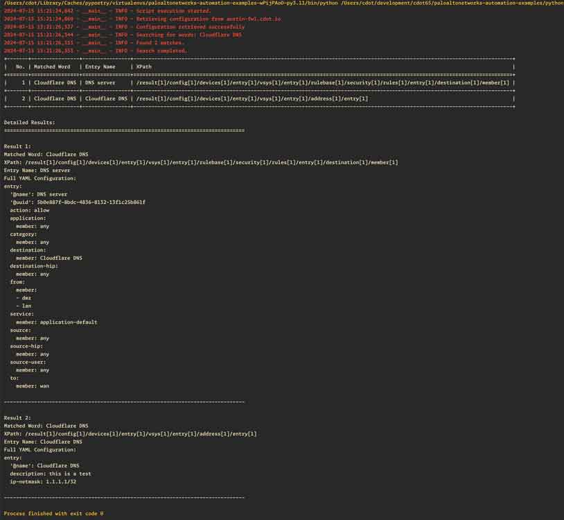

This README provides an overview of our PAN-OS Global Search Tool and guides you through the setup and execution process. 🚀

## Table of Contents

- [PAN-OS Global Search Tool 🔍](#pan-os-global-search-tool-)
  - [Table of Contents](#table-of-contents)
  - [Overview](#overview)
  - [Prerequisites](#prerequisites)
  - [Setup](#setup)
    - [Creating a Python Virtual Environment](#creating-a-python-virtual-environment)
    - [Installing Dependencies](#installing-dependencies)
    - [Configuring Environment Variables](#configuring-environment-variables)
  - [Script Structure](#script-structure)
  - [Execution Workflow](#execution-workflow)
    - [Command-line Arguments](#command-line-arguments)
    - [Example Usage](#example-usage)

## Overview

Our PAN-OS Global Search Tool is designed to search for specific keywords within the XML configuration of a live PAN-OS firewall. It retrieves the full configuration, searches for specified keywords, and presents the results in a user-friendly format, including XPath, entry name, and full YAML configuration for each match. 🎯

## Prerequisites

Before getting started, ensure that you have the following prerequisites installed on your local machine:

- Python (version 3.11+) 🐍
- pip (Python package manager) 📦

## Setup

### Creating a Python Virtual Environment

To create a Python virtual environment, follow these steps:

1. Open a terminal and navigate to the project directory.
2. Run the following command to create a virtual environment:

   ```bash
   python -m venv venv
   ```

3. Activate the virtual environment:

   - For Windows:

     ```bash
     venv\Scripts\activate
     ```

   - For macOS and Linux:

     ```bash
     source venv/bin/activate
     ```

### Installing Dependencies

To install the required Python packages within your virtual environment, execute:

```bash
pip install -r requirements.txt
```

### Configuring Environment Variables

Our script uses `dynaconf` for configuration management. Create or update the following files in your project directory:

Create a file named `.secrets.yaml`:

```yaml
---
hostname: "your-firewall.example.com"
api_key: "your-api-key"
```

Create a file named `settings.yaml`:

```yaml
---
keywords:
  - keyword1
  - keyword2
  - keyword3
```

## Script Structure

Our Python script (`search.py`) is structured as follows:

```python
"""Search for instances of words within a live PAN-OS firewall's XML configuration.

This script will retrieve the full XML configuration from a live PAN-OS firewall,
then locate all instances of specified words within the configuration,
providing XPath, entry name, and full YAML configuration for each match.

(c) 2024 Your Name
"""

# Imports and global variables

# Function definitions (get_firewall_config, get_xpath, get_entry_name, etc.)

def main():
    # Main execution logic
    # 1. Parse command-line arguments
    # 2. Retrieve firewall configuration
    # 3. Search for keywords
    # 4. Present results

if __name__ == "__main__":
    main()
```

The script is designed to:

1. Load environment variables for firewall credentials using `dynaconf`.
2. Retrieve the full XML configuration from a live PAN-OS firewall.
3. Search for specified keywords within the configuration.
4. Present the results, including XPath, entry name, and full YAML configuration for each match.
5. Log activities and errors for debugging purposes.

## Execution Workflow

To execute our Python script, follow these steps:

1. Ensure that you have activated the Python virtual environment.
2. Run the following command:

   ```bash
   python search.py
   ```

### Command-line Arguments

The script supports the following command-line arguments:

- `-d` or `--debug`: Enable debug logging

### Example Usage

To search using the keywords defined in `settings.yaml`:

```bash
python search.py
```

To enable debug logging:

```bash
python search.py --debug
```

### Screenshots

Here are some screenshots showcasing the execution of our Python script:


_Searching for "Cloudflare DNS", defined in `settings.yaml`_

Feel free to explore the script and customize it according to your specific requirements. Happy searching! 😄