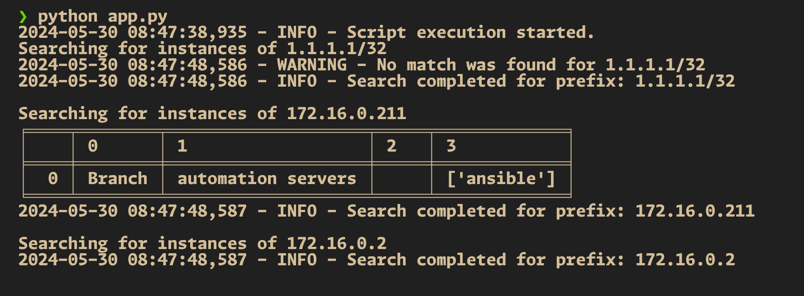
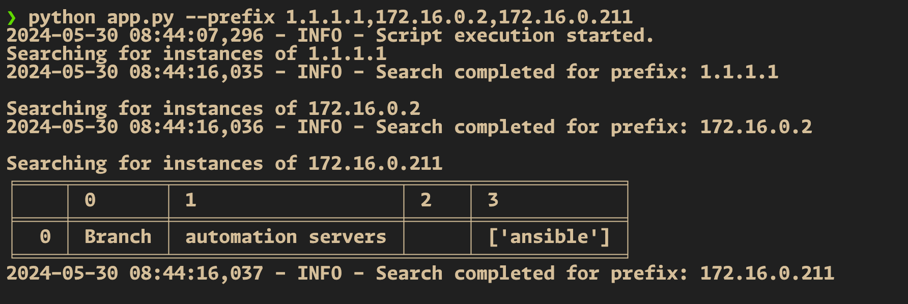

# pan-os-object-search 📚

This README provides an overview of our Python project and guides you through the setup and execution process. 🚀

## Table of Contents

- [pan-os-object-search 📚](#pan-os-object-search-)
  - [Table of Contents](#table-of-contents)
  - [Overview](#overview)
  - [Prerequisites](#prerequisites)
  - [Setup](#setup)
    - [Creating a Python Virtual Environment](#creating-a-python-virtual-environment)
    - [Installing Python Packages](#installing-python-packages)
  - [Script Structure](#script-structure)
  - [Execution Workflow](#execution-workflow)
    - [Screenshots](#screenshots)

## Overview

Our Python project aims to automate the configuration and deployment of a search tool for address objects in a Palo Alto Networks firewall configuration. By leveraging Python's powerful automation capabilities, we can streamline the process and ensure consistent and reproducible results across multiple environments. 🎯

## Prerequisites

Before getting started, ensure that you have the following prerequisites installed on your local machine:

- Python (version 3.11+) 🐍
- pip (Python package manager) 📦

## Setup

### Creating a Python Virtual Environment

To create a Python virtual environment, follow these steps:

1. Open a terminal and navigate to the project directory.
2. Run the following command to create a virtual environment:

   ```bash
   python -m venv venv
   ```

3. Activate the virtual environment:

   - For Windows:

     ```bash
     venv\Scripts\activate
     ```

   - For macOS and Linux:

     ```bash
     source venv/bin/activate
     ```

### Installing Python Packages

To install the required Python packages within our virtual environment, execute:

```bash
pip install -r requirements.txt
```

## Script Structure

Our Python script (`pan-os-object-search.py`) is structured as follows:

```python
"""Search for instances of address objects.

This script will locate all instances of an AddressObject within
the firewall's configuration.

Licensed under the Apache License, Version 2.0 (the "License");
you may not use this file except in compliance with the License.
You may obtain a copy of the License at
  http://www.apache.org/licenses/LICENSE-2.0
Unless required by applicable law or agreed to in writing, software
distributed under the License is distributed on an "AS IS" BASIS,
WITHOUT WARRANTIES OR CONDITIONS OF ANY KIND, either express or implied.
See the License for the specific language governing permissions and
limitations under the License.

(c) 2022 Calvin Remsburg
"""
```

The script is designed to:
1. Load environment variables for Panorama credentials.
2. Retrieve configuration objects from Panorama.
3. Search for a specified address object and its associations.
4. Present the results in a tabulated format using `tabulate`.

## Execution Workflow

To execute our Python script, follow these steps:

1. Ensure that you have activated the Python virtual environment.
2. Run the following command:

   ```bash
   python pan-os-object-search.py --prefix [your-search-prefix]
   ```

For example:
```bash
python pan-os-object-search.py --prefix 192.168.1.1
```

### Screenshots

Here are some screenshots showcasing the execution of our Python script:




Feel free to explore the script and customize it according to your specific requirements. Happy automating! 😄
