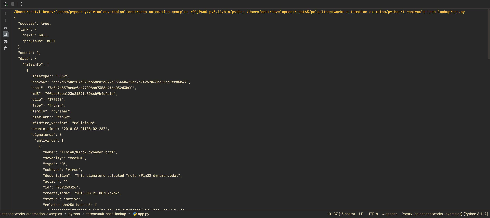

# ThreatVault Lookup Project 📚

This README provides an overview of our Python project and guides you through the setup and execution process. 🚀

## Table of Contents

- [Overview](#overview)
- [Prerequisites](#prerequisites)
- [Setup](#setup)
  - [Creating a Python Virtual Environment](#creating-a-python-virtual-environment)
  - [Installing Dependencies](#installing-dependencies)
- [Script Structure](#script-structure)
- [Execution Workflow](#execution-workflow)

## Overview

Our Python project aims to automate the configuration and deployment of a script that calculates SHA-256 hashes for files in a directory and looks up threat data using the ThreatVault API. By leveraging Python's powerful automation capabilities, we can streamline the process and ensure consistent and reproducible results across multiple environments. 🎯

## Prerequisites

Before getting started, ensure that you have the following prerequisites installed on your local machine:

- Python (version 3.11+) 🐍
- pip (Python package manager) 📦

## Setup

### Creating a Python Virtual Environment

To create a Python virtual environment, follow these steps:

1. Open a terminal and navigate to the project directory.
2. Run the following command to create a virtual environment:

   ```bash
   python -m venv venv
   ```

3. Activate the virtual environment:

   - For Windows:

     ```bash
     venv\Scripts\activate
     ```

   - For macOS and Linux:

     ```bash
     source venv/bin/activate
     ```

### Installing Dependencies

To install the required Python packages within the virtual environment, run the following command:

```bash
pip install -r requirements.txt
```

## Script Structure

Our Python script (`threat_lookup.py`) is structured as follows:

```python
import os
import hashlib
import requests
import json
from typing import List, Optional
from config import settings

def calculate_sha256(file_path: str) -> str:
    #...

def get_file_hashes(directory: str) -> List[str]:
    #...

def threat_vault_lookup(sha256_list: List[str]) -> Optional[dict]:
    #...

def main() -> None:
    #...

if __name__ == '__main__':
    main()
```

The script contains the following key functions:

1. `calculate_sha256(file_path: str) -> str`:
   - Calculates and returns the SHA-256 hash of a given file.
   
2. `get_file_hashes(directory: str) -> List[str]`:
   - Iterates over all files in a directory and calculates their SHA-256 hash values.
   
3. `threat_vault_lookup(sha256_list: List[str]) -> Optional[dict]`:
   - Performs a ThreatVault API lookup for the given list of SHA-256 hashes and returns the retrieved threat data.
   
4. `main() -> None`:
   - The main function that orchestrates the script's execution, demonstrating the usage of the above functions.

## Execution Workflow

To execute our Python script, follow these steps:

1. Ensure that you have activated the Python virtual environment.
2. Run the following command:

   ```bash
   python threat_lookup.py
   ```

### Screenshots

Here are some screenshots showcasing the execution of our Python script:




Feel free to explore the script and customize it according to your specific requirements. Happy automating! 😄