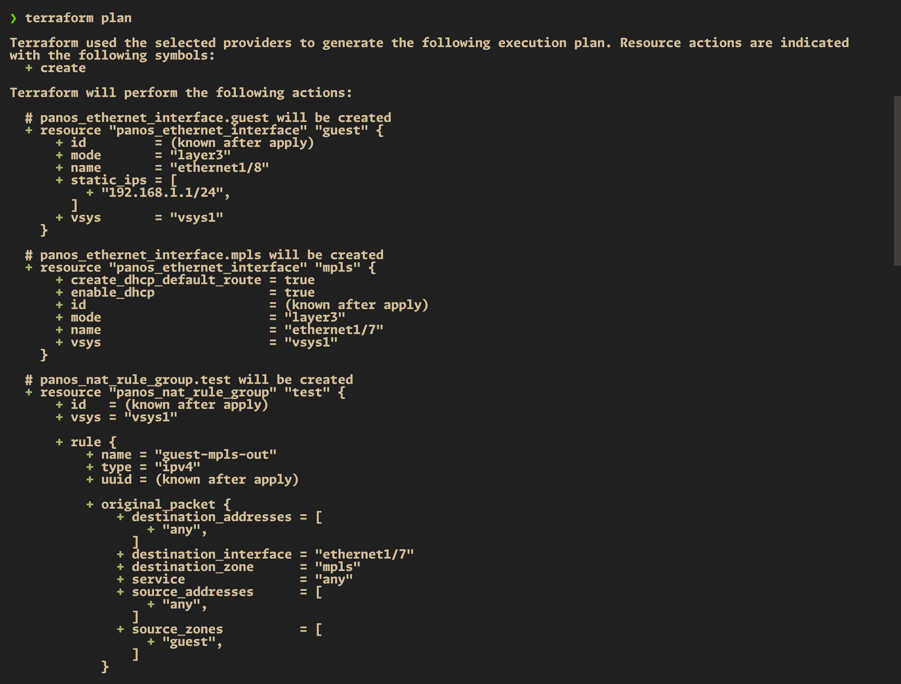

# PAN-OS Configuration Management 📚

This README provides an overview of our Terraform project and guides you through the setup and execution process. 🚀

## Table of Contents

- [PAN-OS Configuration Management 📚](#pan-os-configuration-management-)
  - [Table of Contents](#table-of-contents)
  - [Overview](#overview)
  - [Prerequisites](#prerequisites)
  - [Setup](#setup)
    - [Creating a Terraform Environment](#creating-a-terraform-environment)
    - [Installing Dependencies](#installing-dependencies)
  - [Project Structure](#project-structure)
  - [Terraform Provider Configuration](#terraform-provider-configuration)
  - [Terraform Resources](#terraform-resources)
  - [Terraform Variables](#terraform-variables)
  - [Terraform Variable Definitions](#terraform-variable-definitions)
  - [Execution Workflow](#execution-workflow)
    - [Screenshots](#screenshots)

## Overview

Our Terraform project aims to manage the configuration of PAN-OS devices like firewalls and Panorama. It includes setting up ethernet interfaces, virtual routers, security zones, service objects, NAT policies, and security policies. 🎯

## Prerequisites

Before getting started, ensure that you have the following prerequisites installed on your local machine:

- Terraform (version 1.20+) 🔧

## Setup

### Creating a Terraform Environment

To create a Terraform environment, follow these steps:

1. Clone the repository to your local machine.
2. Navigate to the project directory.
3. Create a `terraform.tfvars` file and provide the necessary variable values (see `terraform.tfvars` for reference).

### Installing Dependencies

Install our project's dependencies:

```bash
terraform init
```

## Project Structure

Our project consists of the following Terraform files:

- `configure_panos.tf`: Contains resource definitions for configuring PAN-OS devices, including ethernet interfaces, virtual routers, security zones, service objects, NAT policies, and security policies.
- `variables.tf`: Defines input variables used in the configuration.
- `terraform.tfvars`: Provides values for the defined variables.
- `panos_provider.tf`: Configures the PAN-OS provider for Terraform.

These files work together to manage the configuration of PAN-OS devices. The `configure_panos.tf` file uses the variables defined in `variables.tf` and the values provided in `terraform.tfvars` to create the necessary resources on the PAN-OS device specified in `panos_provider.tf`.

## Terraform Provider Configuration

The `panos_provider.tf` file contains the configuration for the PAN-OS provider in Terraform. It specifies the required version of the provider and the connection details for the PAN-OS device.

In our example, the `panos_provider.tf` file includes the following:

- `terraform` block:
  - `required_providers` block:
    - `panos` provider:
      - `source`: Specifies the source of the PAN-OS provider, which is "PaloAltoNetworks/panos".
      - `version`: Specifies the required version of the PAN-OS provider, which is "1.11.1".

- `provider` block:
  - `panos` provider:
    - `hostname`: Sets the hostname or IP address of the PAN-OS device, using the value from the `firewall.fw_ip` variable.
    - `username`: Sets the username for authentication, using the value from the `firewall.username` variable.
    - `password`: Sets the password for authentication, using the value from the `firewall.password` variable.

This configuration ensures that the PAN-OS provider is properly initialized and connected to the specified PAN-OS device using the provided connection details.

## Terraform Resources

The `configure_panos.tf` file defines several Terraform resources to manage the configuration of PAN-OS devices. Here's a brief explanation of each resource:

- `panos_ethernet_interface`: Configures ethernet interfaces on the PAN-OS device, specifying properties like name, mode, vsys, and IP addresses.
- `panos_virtual_router`: Creates a virtual router on the PAN-OS device and associates it with the configured ethernet interfaces.
- `panos_zone`: Defines security zones on the PAN-OS device and associates them with the configured ethernet interfaces.
- `panos_service_object`: Creates service objects on the PAN-OS device, specifying properties like name, vsys, protocol, description, and destination port.
- `panos_nat_rule_group`: Configures NAT policies on the PAN-OS device, specifying the original and translated packet details.
- `panos_security_policy`: Defines security policies on the PAN-OS device, specifying properties like name, audit comment, source and destination zones, addresses, applications, services, categories, and action.

These resources are created and managed by Terraform based on the configuration provided in the `configure_panos.tf` file and the values defined in `variables.tf` and `terraform.tfvars`.

## Terraform Variables

The `terraform.tfvars` file is used to provide values for the input variables defined in the `variables.tf` file. It allows you to customize the configuration without modifying the main Terraform files.

In our example, the `terraform.tfvars` file contains the following sections:

- `firewall`: Specifies the connectivity details for the PAN-OS device, including the IP address, username, and password.
- `ethernet_interfaces`: Defines the configuration for ethernet interfaces, including the name, mode, vsys, and static IP addresses.
- `vr_name`: Sets the name of the virtual router.
- `zones`: Defines the configuration for security zones, including the name and mode.
- `service_objects`: Specifies the configuration for service objects, including the name, vsys, protocol, description, and destination port.
- `nat_policies`: Defines the configuration for NAT policies, including the name, audit comment, source and destination zones, interfaces, and addresses.
- `security_policies`: Specifies the configuration for security policies, including the name, audit comment, source and destination zones, addresses, applications, services, categories, and action.

By providing values in the `terraform.tfvars` file, you can easily customize the configuration for your specific PAN-OS device without modifying the main Terraform files.

## Terraform Variable Definitions

The `variables.tf` file defines the input variables used in the Terraform configuration. It specifies the structure and type of each variable, allowing you to parameterize the configuration.

In our example, the `variables.tf` file contains the following variable definitions:

- `firewall`: Defines the structure for the firewall connection details, including the IP address, username, and password.
- `ethernet_interfaces`: Defines the structure for ethernet interface configurations, including the name, mode, vsys, and static IP addresses.
- `vr_name`: Defines the variable for the virtual router name.
- `zones`: Defines the structure for security zone configurations, including the name and mode.
- `service_objects`: Defines the structure for service object configurations, including the name, vsys, protocol, description, and destination port.
- `nat_policies`: Defines the structure for NAT policy configurations, including the name, audit comment, source and destination zones, interfaces, and addresses.
- `security_policies`: Defines the structure for security policy configurations, including the name, audit comment, source and destination zones, addresses, applications, services, categories, and action.

These variable definitions provide a clear structure for the input variables used in the Terraform configuration. The actual values for these variables are provided in the `terraform.tfvars` file.

## Execution Workflow

To execute our Terraform project, follow these steps:

1. Ensure you have completed the setup steps mentioned above.
2. Run the following command to preview the changes:

  ```shell
  terraform plan
  ```

3. If the plan looks good, apply the changes:

  ```shell
  terraform apply
  ```

4. Confirm the execution by typing `yes` when prompted.

### Screenshots

Here are some screenshots showcasing the execution of our PAN-OS configuration management:




Feel free to explore the project and customize it according to your specific requirements. Happy automating! 😄
